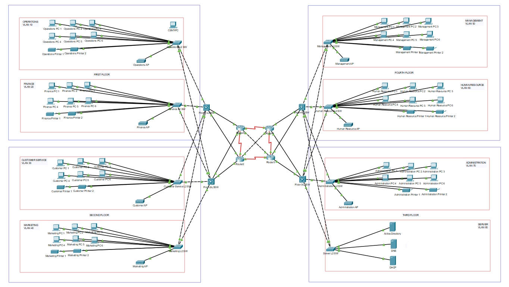
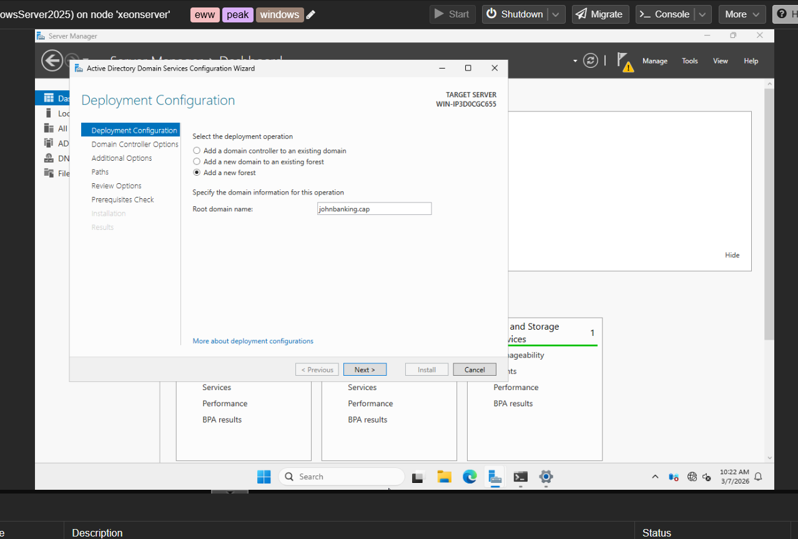
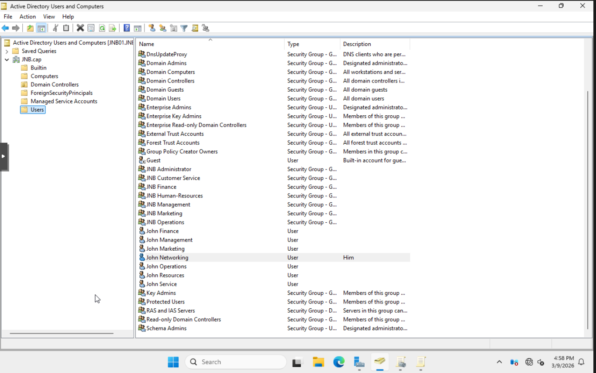
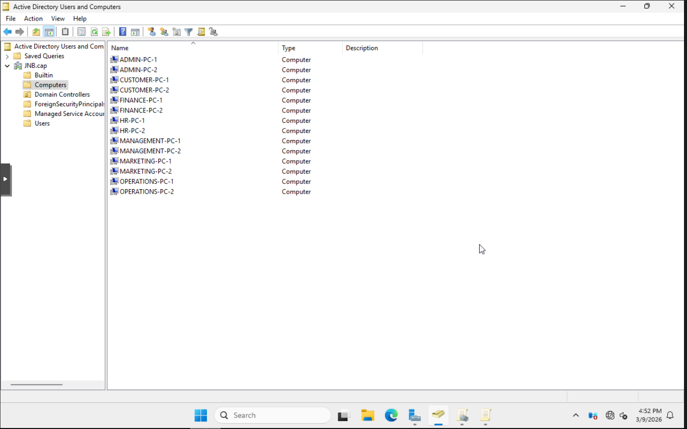
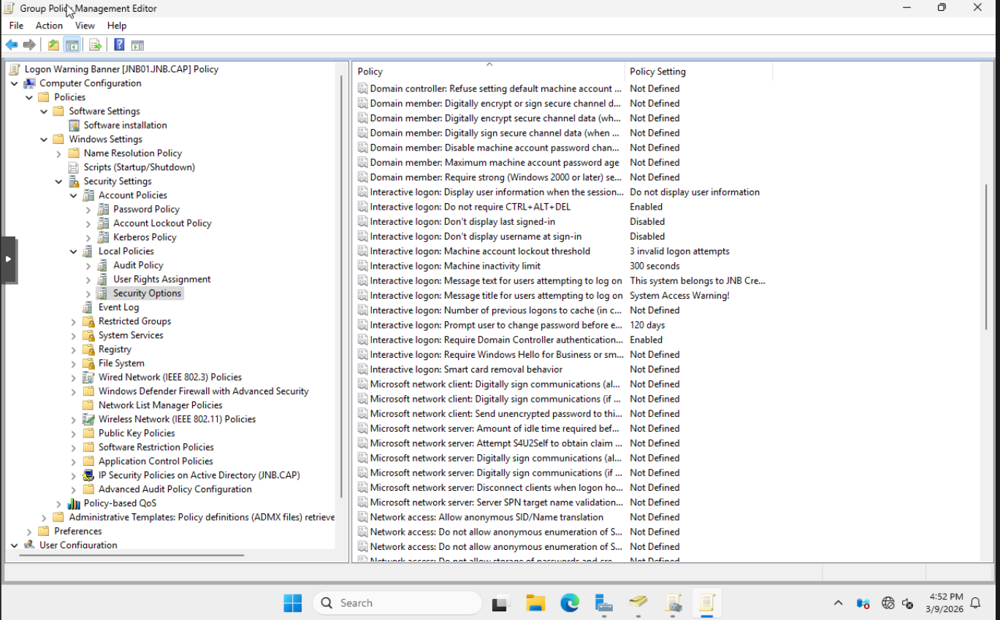
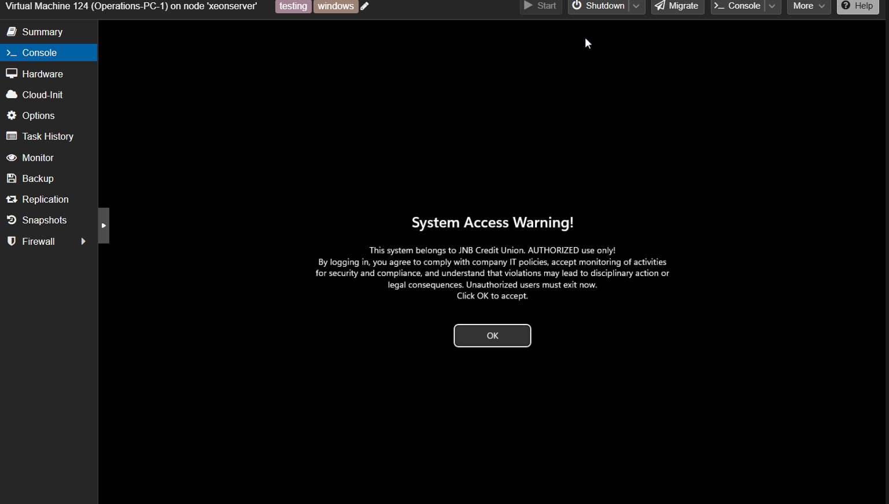
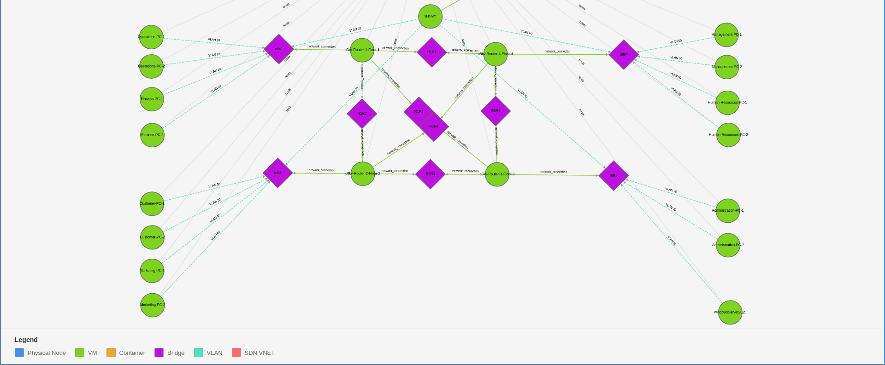

# The Simulated Network Project

By James, Johnny, and Devon

## Objective:
This project demonstrates the designing, configuring, and deploying enterprise-scale network using CCNA knowledge on a traditional on-premise infrastructure using packet-tracer and hybrid cloud infrastructure using ProxMox. 

## Motivation:
As recent students completing the CCNA course, this hands-on project validates our ability to architect a real-world topology while testing scalability and best practices in a controlled environment.  

## Key Features: 

- Multi-VLAN segmentation
- Dynamic Routing
- Redundancy
- DHCP
- Security
- Monitoring/Troubleshooting
- Scalability
- Active Directory
- Automation*

Note: *Dependency on time

## Requirements:

- Physical Server 
- Wireguard
- Packet Tracer
- CCNA Knowledge
- ProxMox
- Laptop/Desktop 

## Updates:

Week 1:
```
Discuss - Physical topology
Discuss - Logical topology
Discuss - Objectives and Goals

Design - Physical topology
Design - Logical topology

Configuration - Tuning Windows 11 sepcifications
  
Implement - Physical Server Upgrades
Implement - Wireguard (remote access)
Implement - ProxMox - Network Bridges
Implement - ProxMox - Network Connections
Implement - ProxMox - Virtual Machines - Desktop PC
Implement - ProxMox - Virtual Machines - Routers

Update - timesheet

Notes:
```


Week 2:
```
Design - Addressing Table

Configuration - Label connections on all devices
Configuration - NUMA on Windows Virtual Machines

Implement - Packet Tracer - Routers
Implement - Packet Tracer - Switches
Implement - Packet Tracer - Desktop PCs

Update - time sheet

Notes:
```


Week 3:
```
Discuss - Delegation of device configuration 
Discuss - Delegation of device hardening 

Design - Topology of network on Packet Tracer
Design - Refine addressing table 

Configuration - Packet Tracer - Device connections 
Configuration - Packet Tracer - Device cabling
Configuration - ProxMox - Configurations
Configuration - ProxMox - Virtual Machine Tags
Configuration - ProxMox - Spice 

Implement - GitLab Repository
Implement - GitLab READme

Update - timesheet

Notes:
```


Week 4:
```
Discuss - Logical Topology to version 2.0 
Discuss - Verification of final copy of addressing table

Design - Logical Topology 2.0
Design - Device Configuration - Routers
Design - Device Configuration - Switches
Design - ProxMox - MAC address to Interface table

Configuration - Packet Tracer - Routers
Configuration - Packet Tracer - Switches
Configuration - Packet Tracer - Desktop PCs

Implement - Packet Tracer - Network connectivity testing 
Implement - ProxMox - Add address to bridges

Update - timesheet

Notes:
Add addresses to the bridges and switched virtual machines and appropriate tags to VMs
Updated network bridges, replaced machines with Cisco 8000 virtual routers
```


Week 5:
```
Discuss - Research on open vswitches
Discuss - Move hardening configurations as future task 
Discuss - Adding Active Directory to ProxMox

Design - Changes to topology
Design - Packet Tracer - DHCP
Design - Packet Tracer - VLANs

Configuration - MAC Address tagle to reflect new bridges
Configuration - Packet Tracer - DHCP
Configuration - Packet Tracer - VLANs
Configuration - Packet Tracer - OSPF

Implement - Testing inter-vlan with OVS bridges
Implement - Replace Linux bridges with OVS bridges
Implement - Establish connectivity between VLANs
Implement - Establish connectivity between OVS

Update - timesheet

Notes: 
```


Week 6:
```
Planning & Designing:

Discuss - Week 7 plans

Design - Packet Tracer - Hardening Configuration

Troubleshoot - Packet Tracer - DHCP
Troubleshoot - Packet Tracer - VLANs

Configuration - Packet Tracer - DHCP
Configuration - Packet Tracer - VLANs
Configuration - Packet Tracer - OSPF

Implement - Packet Tracer - OSPF
Implement - Packet Tracer - DHCP
Implement - Packet Tracer - VLANs

Update - timesheet

Notes:
Deployment scripts on ProxMox
```


Week 7:
```
Update - timesheet

Notes: 
Reading Break - No classes in session this week
No work was done this week as we prepared for the CCNA Certification Exam
```


Week 8:
```
Discuss - Current roadmap and upcoming expectations

Update - timesheet

Notes:
School is back in session from reading break
```


Week 9:
```
Discuss - Configuration file for ProxMox
Discuss - In-depth plan for in class activity

Configuration - DHCP config for routers

Implement - Windows 2025 Server 
Implement - Router Hardening 
Implement - Active Directory
Implement - Domain Name System

Update - READMe
Update - time sheet

Notes:
```


Week 10:
```
Discuss - Class activity 

Design - ProxMox Topology

Troubleshoot - Network connectivity
Troubleshoot - Remote SSH to routers

Configuration - Router OSPF cable connections
Configuration - Open Short First Path CLI configs
Configuration - Active Directory - Users and Groups
Configuration - Active Directory - Interactive Logon Banner
Configuration - Active Directory - Logon PNG Background
Configuration - Active Directory - Account Policy
Configuration - Active Directory - Password Policy
Configuration - Active Directory - Joining virtual machines to JNB domain

Implement - Active Directory - GPO

Update - READMe
Update - timesheet

Notes:
```





